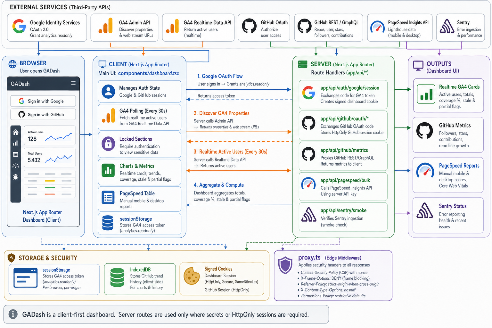

<div align="center">
  

  **📊 Private realtime dashboard for sites and code 📊**
</div>

GADash is a private Next.js dashboard for checking GA4 realtime activity, GitHub account momentum, and PageSpeed health from one screen.

It opens directly to the dashboard. Google sign-in unlocks GA4 realtime cards and PageSpeed checks, while GitHub sign-in unlocks profile, repository, and contribution metrics through server route handlers.

## Install

```bash
git clone git@github.com:tsilva/gadash.git
cd gadash
pnpm install
cp .env.example .env.local
pnpm dev
```

Open [http://localhost:3000](http://localhost:3000), then sign in with Google or GitHub from the top bar.

## Commands

```bash
pnpm dev      # start the local Next.js server
pnpm build    # create a production build
pnpm start    # run the production build locally
pnpm lint     # run ESLint
pnpm test     # run Node test runner tests through tsx
```

## Configuration

Copy `.env.example` to `.env.local` and fill in only the integrations you plan to use.

| Variable | Purpose |
| --- | --- |
| `NEXT_PUBLIC_GOOGLE_CLIENT_ID` | Google OAuth client used by dashboard sign-in and GA4 token flow |
| `NEXT_PUBLIC_GOOGLE_AUTHORIZED_ORIGINS` | Origins allowed to use Google sign-in |
| `ALLOWED_GOOGLE_EMAILS` | Google account allowlist for server-backed dashboard actions |
| `AUTH_SESSION_SECRET` | Production secret for signed Google dashboard and GitHub cookies |
| `NEXT_PUBLIC_GITHUB_CLIENT_ID` | GitHub OAuth app client ID |
| `NEXT_PUBLIC_GITHUB_AUTHORIZED_ORIGINS` | Origins allowed to start GitHub OAuth |
| `GITHUB_CLIENT_SECRET` | GitHub OAuth app secret, used only by server route handlers |
| `NEXT_PUBLIC_GA_PROPERTIES_JSON` | Optional fallback GA4 property list when Admin API discovery is unavailable |
| `PAGESPEED_API_KEY` | Optional PageSpeed Insights API key for server-side checks |
| `NEXT_PUBLIC_SENTRY_DSN`, `SENTRY_DSN` | Optional browser and server Sentry reporting |
| `SENTRY_AUTH_TOKEN`, `SENTRY_ORG`, `SENTRY_PROJECT` | Optional Sentry source-map upload configuration |

For Google, create a web OAuth client, enable the Google Analytics Data API and Admin API, and add `http://localhost:3000` plus your production origin to Authorized JavaScript origins.

For GitHub, create an OAuth App with `http://localhost:3000/api/github/oauth/callback` as the local callback URL. Leave the GitHub variables blank to keep that section disabled.

## Notes

- This is a Next.js App Router project using pnpm 10.27.0, React 19.2, TypeScript, and plain CSS.
- The repo enforces pnpm in `preinstall`.
- GA4 realtime data polls every 30 seconds after Google Analytics consent.
- The short-lived GA4 access token is kept in browser `localStorage` until it expires or you sign out; GitHub and dashboard sessions use signed or HttpOnly cookies.
- GitHub trend snapshots are stored in browser-local IndexedDB and are not synced across devices.
- PageSpeed reports are manual, run through server route handlers, and are not persisted.
- `proxy.ts` applies the nonce-based CSP and other browser hardening headers.
- Vercel is the intended host. Register production origins and callback URLs with Google and GitHub before deploying.

## Architecture



## License

No license file is included in this repository.
