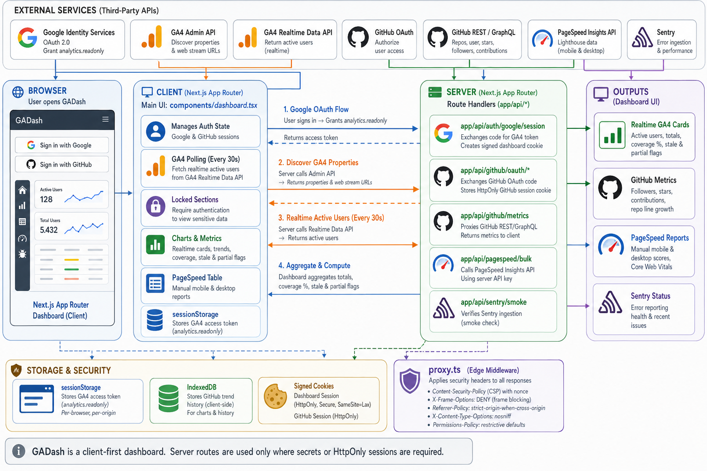

<div align="center">
  

  **📊 Private realtime dashboard for sites and code 📊**
</div>

GADash is a private Next.js dashboard for checking GA4 realtime activity, GitHub account momentum, and PageSpeed health from one screen.

It opens directly to the dashboard. Google sign-in unlocks GA4 realtime cards and PageSpeed checks, while GitHub sign-in unlocks profile, repository, and contribution metrics through server route handlers.

## Install

```bash
git clone git@github.com:tsilva/gadash.git
cd gadash
pnpm install
pnpm secrets:check
pnpm dev
```

Open the URL printed by the development server, then sign in with Google or GitHub from the top bar. Normal `pnpm dev` uses Next.js port 3000 to match the OAuth provider configuration. `pnpm dev --port auto` supports an isolated check; Google/GitHub sign-in at that random origin requires registering it with those providers.

## Commands

```bash
pnpm dev      # start the local Next.js server
pnpm build    # create a production build
pnpm start    # run the production build locally
pnpm lint     # run ESLint
pnpm test     # run Node test runner tests through tsx
```

## Configuration

Production credentials live separately in `gadash-production`, Production `/`, with automatic sync to Vercel Production. Redeploy after secret changes; existing deployments retain their environment snapshot. Public configuration remains in Vercel. `pnpm secrets:migrate:keyenv` imports manifest-bound credentials with exact readback and retains Keychain originals.
Copy only public client configuration and non-secret defaults from
`.env.example` to `.env.local`.

| Variable | Purpose |
| --- | --- |
| `NEXT_PUBLIC_GOOGLE_CLIENT_ID` | Google OAuth client used by dashboard sign-in and GA4 token flow |
| `NEXT_PUBLIC_GOOGLE_AUTHORIZED_ORIGINS` | Origins allowed to use Google sign-in |
| `NEXT_PUBLIC_GA_MEASUREMENT_ID` | GA4 measurement ID for tracking visits to GADash itself |
| `ALLOWED_GOOGLE_EMAILS` | Google account allowlist for server-backed dashboard actions |
| `AUTH_SESSION_SECRET` | Production secret for signed Google dashboard and GitHub cookies |
| `NEXT_PUBLIC_GITHUB_CLIENT_ID` | GitHub OAuth app client ID |
| `NEXT_PUBLIC_GITHUB_AUTHORIZED_ORIGINS` | Origins allowed to start GitHub OAuth |
| `GITHUB_CLIENT_SECRET` | GitHub OAuth app secret, used only by server route handlers |
| `NEXT_PUBLIC_GA_PROPERTIES_JSON` | Optional fallback GA4 property list when Admin API discovery is unavailable |
| `PAGESPEED_API_KEY` | Optional PageSpeed Insights API key for server-side checks |
| `NEXT_PUBLIC_SENTRY_DSN`, `SENTRY_DSN` | Optional browser and server Sentry reporting |
| `SENTRY_AUTH_TOKEN`, `SENTRY_ORG`, `SENTRY_PROJECT` | Optional Sentry source-map upload configuration |

### Sentry delivery verification

Sentry initializes in the browser before hydration and in the Node and edge runtimes. It is enabled when the corresponding DSN is configured, except in tests, and is independent of Google Analytics sign-in/consent. The CSP permits HTTPS connections only to the browser DSN's exact ingestion origin; it never includes the DSN key. There is no custom ingestion tunnel. Browser environment defaults to `NEXT_PUBLIC_VERCEL_ENV` or `NODE_ENV`; server environment can be overridden with `SENTRY_ENVIRONMENT`.

Setup and queue flushing do not prove event delivery. With approval to send one synthetic browser error, record its event ID and the envelope request's successful collection response in browser Network tools. Then find that same error event in the intended Sentry organization/project (`tsilva` / `gadash`) and confirm environment `production`, release, and timestamp. Session or transaction envelopes alone are insufficient. If dashboard access is unavailable, report delivery as unverified.

The optional server check at `GET /api/sentry/smoke` requires `SENTRY_SMOKE_TEST_TOKEN` via `x-sentry-smoke-token`. It sends a synthetic server error, so use it only with approval. It returns 404 without authorization and 503 if Sentry is disabled or the queue fails to flush. Its `eventId` and `queueFlushed` response describes SDK queue state, not ingestion acceptance; verify the same event in Sentry. A server check does not establish browser delivery. Never put the token in a URL or shared log.

For Google, create a web OAuth client, enable the Google Analytics Data API and Admin API, and add `http://localhost:3000` plus your production origin to Authorized JavaScript origins.

For GitHub, create an OAuth App with `http://localhost:3000/api/github/oauth/callback` as the local callback URL. Leave the GitHub variables blank to keep that section disabled.

## Google Analytics website tracking

`NEXT_PUBLIC_GA_MEASUREMENT_ID` tracks visits to GADash itself, separately from the GA4 properties shown in the dashboard and from Vercel Analytics. Set it for the intended GA4 web stream in Vercel Production before building; changing the value requires a redeploy.

The website tracking preference is separate from Google OAuth permissions. The Google tag stays unloaded until the visitor selects **Allow Google Analytics**. A first-party preference cookie remembers the choice for 180 days; **Decline** or **Disable Google Analytics** stops collection and reloads the page without the tag. Advertising consent remains denied. Both Google scripts receive the request CSP nonce and initialize after hydration, without waiting for browser idle time.

To verify delivery after an approved deployment and test visit, record a successful browser response to a Google Analytics `/g/collect` request with `en=page_view`, after tracking consent. Privately compare the request destination with the intended stream, then confirm the corresponding pageview in that stream's GA4 Realtime or DebugView report. A detected tag or successful HTTP response alone does not confirm GA4 receipt. Do not share measurement IDs, cookies, tokens, or raw request URLs in verification logs. See [the current verification record](docs/analytics-delivery-verification.md).

## Notes

- This is a Next.js App Router project using pnpm 10.27.0, React 19.2, TypeScript, and plain CSS.
- The repo enforces pnpm in `preinstall`.
- GA4 realtime data polls every 30 seconds after Google Analytics consent.
- The short-lived GA4 access token is kept in browser `localStorage` until it expires or you sign out; GitHub and dashboard sessions use signed or HttpOnly cookies.
- GitHub trend snapshots are stored in browser-local IndexedDB and are not synced across devices.
- PageSpeed reports are manual, run through server route handlers, and are not persisted.
- `proxy.ts` applies the nonce-based CSP and other browser hardening headers.
- Vercel is the intended host. Register production origins and callback URLs with Google and GitHub before deploying.

## Architecture



## License

This project is licensed under the [MIT License](LICENSE).
